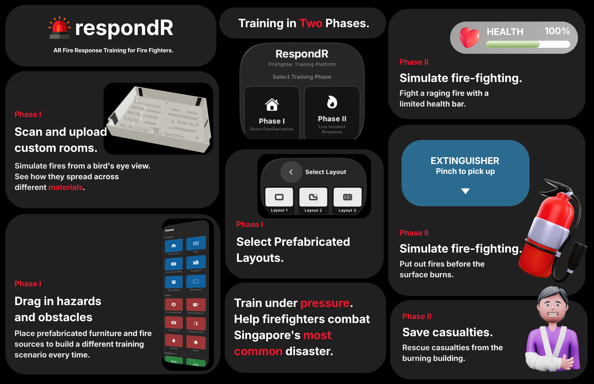

# 🚨 respondR

**AR/VR fire response training for Singapore's firefighters, built on Apple Vision Pro.**

[Watch the demo.](https://youtu.be/tbyR_Sqt9jw)

## Poster

## Overview

respondR is a spatial computing training platform that itends to help Singapore Civil Defence Force (SCDF) firefighters rehearse fire emergency response in realistic, digitized versions of real buildings. 

The goal is to give firefighters unlimited, low-risk repetitions against Singapore's fire scenarios, in spaces that actually resemble the buildings they'll respond to.

---

## How it works

### Phase I: Room Familiarization
- Scan and upload a custom room via iPhone LiDAR with our companion iPhone app or select from prefabricated layouts
- Drag in furniture, hazards, and fire sources to build a training scenario
- Simulate how fire spreads across different materials from a bird's-eye view

### Phase II: Live Incident Response
- Fight a raging, spreading fire against a limited health bar in full immersion on Vision Pro
- Pick up and operate a fire extinguisher to put out fires before they reach the surface
- Locate and rescue casualties from the burning building before time runs out

---

## Technical highlights

| Area | Details |
|---|---|
| **Spatial scanning** | iPhone app built on Apple's **RoomPlan API**, exporting captured rooms as **USDZ** models |
| **3D model sync pipeline** | Custom iPhone to Vision Pro cloud storage pipeline to transfer scanned rooms as 3D models that can be manipulated in AR
| **Immersive simulation** | Native **visionOS** app using RealityKit spatial UI and hand-tracking interactions |
| **CI/CD** | **GitHub Actions** pipeline for automated visionOS builds |

---

## Background

Built at **Spatial Hack AI**, hosted at the Apple Developer Center, a hackathon focused on developing solutions in visionOS and spatial computing.

---
